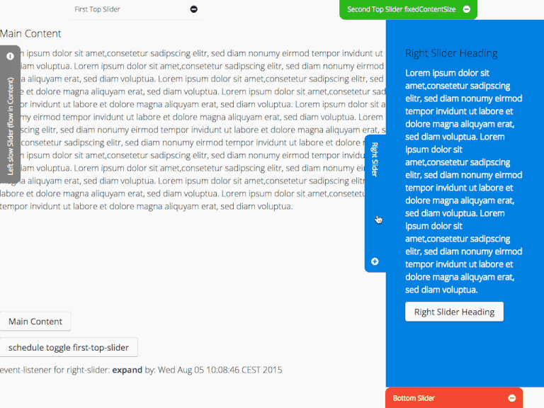
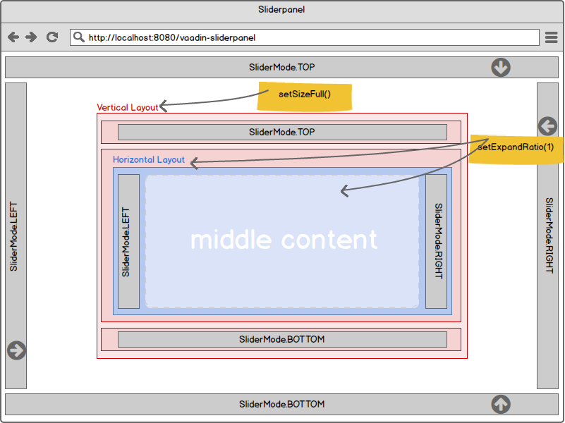
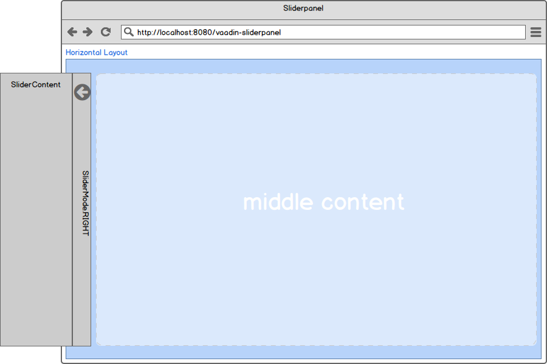

Vaadin SliderPanel
==============

Panel that is able to get collapsed and expand. The expand mode lays over the content...




Workflow
========

Add the dependency to your pom the GWT inherits will get automatically added by the maven-vaadin-plugin.

```xml
<dependency>
    <groupId>org.vaadin.addons</groupId>
    <artifactId>vaadin-sliderpanel</artifactId>
    <version>${vaadin-sliderpanel-version}</version>
</dependency>
```

```xml
<inherits name="org.vaadin.sliderpanel.Widgetset" />
```

You can recolor the panel by changing the css like:

```css
.v-sliderpanel-wrapper .v-sliderpanel-content {
  background: #99CCFF;
  color: #000;
}
.v-sliderpanel-wrapper .v-sliderpanel-tab {
  background: #B1E7FF;
  color: #000;
}
```

Details to the addon you can find on [Vaadin](https://vaadin.com/directory#addon/sliderpanel)

Layouting
========

It's important that you take care for the main layout. Use a combination of VerticalLayout and HorizontalLayout. The SliderPosition is only a hint for the component in which direction the slider should get expand. When you place for example as first component a SliderPanel with SliderMode.RIGHT to a HorizontalLayout and afterwards the middleContent with ExpandRatio(1) it will expand outside the visible browserarea.

```java
protected void init(final VaadinRequest vaadinRequest) {
	final HorizontalLayout mainLayout = new HorizontalLayout();
	mainLayout.setSizeFull();
	
	SliderPanel rightSlider = new SliderPanel(new Label("<h2>SliderContent</h2>", ContentMode.HTML), SliderMode.RIGHT);
	rightSlider.setCaption("SliderCaption");
	mainLayout.addComponent(rightSlider);
	
	VerticalLayout middleContent = new VerticalLayout();
	middleContent.setSizeFull();
	middleContent.addComponent(new Label("<h1>MiddleContent</h1><p>Lots of Content ...</p>", ContentMode.HTML));
	
	mainLayout.addComponent(middleContent);
	mainLayout.setExpandRatio(middleContent, 1);
	setContent(mainLayout);
}
```


The Layouting of the SliderPanel is not made absolute because of the possibility to use it also within the layout:


The MIT License (MIT)
-------------------------

Copyright (c) 2015 Non-Rocket-Science.com

Permission is hereby granted, free of charge, to any person obtaining a copy
of this software and associated documentation files (the "Software"), to deal
in the Software without restriction, including without limitation the rights
to use, copy, modify, merge, publish, distribute, sublicense, and/or sell
copies of the Software, and to permit persons to whom the Software is
furnished to do so, subject to the following conditions:

The above copyright notice and this permission notice shall be included in all
copies or substantial portions of the Software.

THE SOFTWARE IS PROVIDED "AS IS", WITHOUT WARRANTY OF ANY KIND, EXPRESS OR
IMPLIED, INCLUDING BUT NOT LIMITED TO THE WARRANTIES OF MERCHANTABILITY,
FITNESS FOR A PARTICULAR PURPOSE AND NONINFRINGEMENT. IN NO EVENT SHALL THE
AUTHORS OR COPYRIGHT HOLDERS BE LIABLE FOR ANY CLAIM, DAMAGES OR OTHER
LIABILITY, WHETHER IN AN ACTION OF CONTRACT, TORT OR OTHERWISE, ARISING FROM,
OUT OF OR IN CONNECTION WITH THE SOFTWARE OR THE USE OR OTHER DEALINGS IN THE
SOFTWARE.

